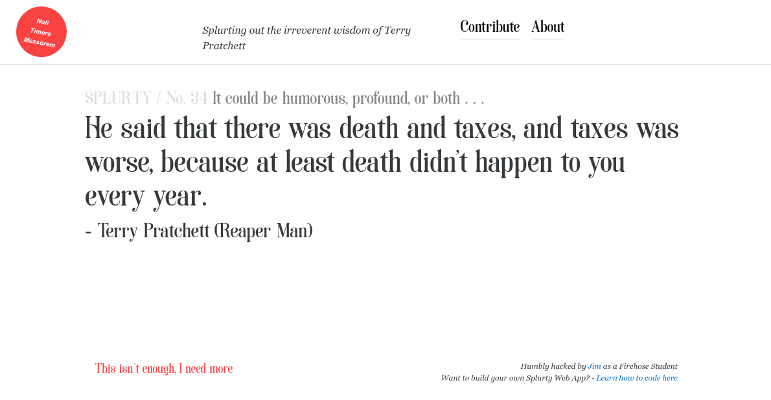

# Splurty
This is a single page app that displays quotes randomly fetched from its database. Site visitors can add their own quotes to the database. A [working version](https://splurty-miljinx.herokuapp.com/) is hosted on Heroku.

### Responsive Layout
Bootstrap is used to ensure proper spacing and alignment is preserved across different browser sizes. A Bootstrap upload modal is also used to maintain the SPA nature of the app.

### Custom Fonts
This app uses the Soria font, available for free from Font Squirrel. By default, Rails does not include fonts in its asset pipeline. They can be added in the `config/application.rb` file with `config.assets.paths << "#{Rails.root}/path/to/fonts"` and `config.assets.precompile += %w( .font .file .extensions )`.

### Uploading Quotes
To be added to the database, quotes must pass through some simple validations. There is 140 character maximum and 3 character minimum, to ensure quotes are optimally viewed on all screen sizes. Since this app is dedicated to Terry Pratchett quotes, his name and the attributed source must be present, although technically there are no checks on the content of the quote itself.
